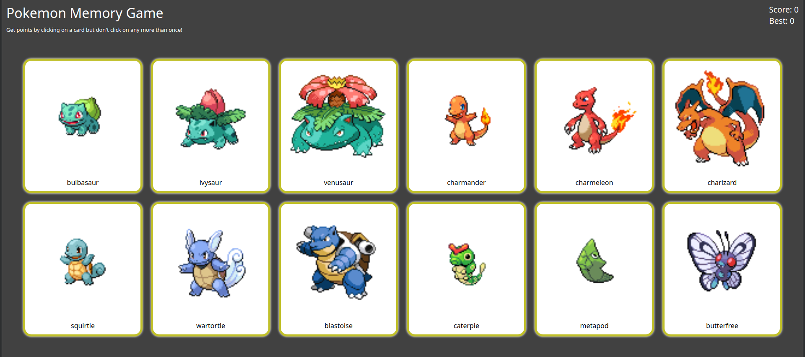

# Memory Card

Completed the Memory Card project as part of The Odin Project's React Course. 
This project focuses on implementing knowledge learnt about effects and states.
To play the game, click on any card. If a player clicks on the same card twice, they lose the round and the current score gets reset.

